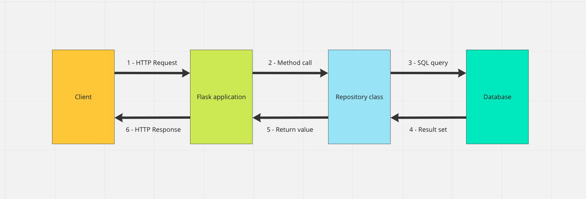

# Test-driving routes that interact with a database

_**This is a Makers Vine.** Vines are designed to gradually build up
sophisticated skills. They contain a mixture of text and video, and may contain
some challenge exercises without proposed solutions. [Read more about how to use
Makers
Vines.](https://github.com/makersacademy/course/blob/main/labels/vines.md)_

Learn to test-drive Flask routes which interact with database-backed classes.

<!-- OMITTED -->

_This section connects together what you've learned working with databases with
what you've learned building web applications._

## Video Intro and Demonstration

[You can view a video version of the below content here](https://www.youtube.com/watch?v=xBz6_cRfr78&t=2591s). Otherwise, read on below.

## Intro

So far you've mostly designed routes that return static data. A realistic web
server program will usually connect to a database, to read data from it (usually
responding to `GET` requests), or write some data into it (usually responding to
`POST` requests).

In the next challenges, you'll learn how to use a database-backed Repository
class inside your Flask application. Here's a simplified schema of how a typical
database-backed web application works:



Let's break down an example:

1. The client sends an HTTP request to the web server over the Internet: `GET
   /books`
2. The web server (a Flask application, in our case) handles the request, and
   executes the route block, which calls the method `BookRepository#all`
3. The Repository class runs a SQL query to the database.
4. The database returns a result set to the program.
5. The Repository class returns a list of `Book` objects to the route block.
6. The route block sends a response to the client containing the data.

The flow described above is what most web applications will implement, so it is
important to get familiar with it, and to have a good mental model on how it
works.

## CRUD Resources

You can imagine web applications as looking after resources (e.g. books, users,
etc). A web application will often allow the user to **C**reate, **R**ead,
**U**pdate and **D**elete these resources. These are known as CRUD operations.

We design HTTP routes to map to CRUD operations on the database sitting behind
the web server.

For example, we could have the following routes mapped to each CRUD operation on
the books database:

```
# Books resource:

# Create a new book
Request: POST /books
  With body parameters: "title=No Place on Earth&author_name=Christa Wolf"
Response: None (just creates the resource on the server)

# Read a single book
Request: GET /books/1
Response: of a single book

# Update a single book
Request: PATCH /books/1
  With body parameters: "title=No Place on Earth&author_name=Christa Wolf"
Response: None (just updates the resource on the server)

# Delete a book
Request: DELETE /books/1
Response: None (just deletes the resource on the server)

# List all the books
Request: GET /books
Response: list of books
```

<details>
  <summary>:speech_balloon: Wait, that's not CRUD — there's a fifth 'list' operation!</summary>

  ---

  Quite! And that Listing operation is very common. It really ought to be in
  there but it sort of ruins the acronym.

  The defence of this is that _List_ is really a Read operation of a list rather
  than a single item.

  ---

</details>

In this case, _we say the Books collection is a "Resource"_ —  we can execute
CRUD operations (Create, Read, Update, Delete) on a given Resource, by sending
HTTP requests to the right method and path.

You've noticed the mapping above uses other HTTP methods, such as `PATCH` and
`DELETE`. They work the same way as `POST`, and we can send certain types of
parameters with them too.

This pattern of routing is often called **RESTful Routing**.

REST refers to a common way of designing web applications based on the idea that
servers and clients are both interested in requesting and changing resources
(e.g. books). The client and server should agree on how to represent those
resources and then how to communicate about changes to them. If you're
interested in reading more in depth, the [RESTful API
resource](https://restfulapi.net) is very thorough.

## Path parameters

You might have noticed the route pattern `/books/1` from the previous mapping —
this path contains a variable part: the book ID.

```
GET /books/1   -> get book with ID 1
GET /books/5   -> get book with ID 5
GET /books/12   -> get book with ID 12
```

But we only know how to handle _query_ or _body_ parameters in Flask, so how do
we use this? This new kind of parameter is called a "path" parameter.

To get this parameter, we put a special `<something>` placeholder in our route,
and then add a parameter to our method. Flask will then extract the data at that
point in the path and pass it into the method as a parameter.

```python
@app.route('/books/<id>')    # <-- New code!
def get_book(id):            # <-- New code!
     # Use id to retrieve the corresponding
     # book from the database.
     return f"Later I'll write the code to get book {id}."

@app.route('/books/<id>', methods=['DELETE'])
def delete_book(id):
     # Use id to delete the corresponding
     # book from the database.
     return f"Later I'll write the code to delete book {id}."
```

## Connecting the server to the database

Take a moment to look at the [diagram above](#Intro) again. Pay particular
attention to the "Flask application" and the "Repository class" and how they
interact.

In the previous Databases module, you created Repository classes to connect to
the databases and make SQL queries to create/read/update/delete information.
The argument supplied when instantiating those Repository classes was
`db_connection` in your test files, which the classes were able to use to
connect to the database.

When the Flask application's routes have to fetch or change data in the
database, those will use the imported Repository classes to do that work. As
before, a connection object will need to be passed in as the argument.

Here's a simplified example of how that might work, with some of the subsequent
detail in the route left out, as it's not important for what we're
demonstrating:

```python
from lib.database_connection import get_flask_database_connection  # <-- New code!
from lib.book_repository import BookRepository
from flask import request

app = Flask(__name__)                                              # <-- New code!

@app.route('/books', methods=['GET'])
def get_books():
    connection = get_flask_database_connection(app)                # <-- New code!
    repository = BookRepository(connection)                        # <-- New code!
    repository.all()
    [...]
```

Note that in the first line, we import `get_flask_database_connection` which is
later used, along with Flask, as the argument to a new `BookRepository`.

You'll be needing code like this in the next exercise! The video accompanying
the exercise uses this same approach, so you can always check that out if you
want to see it being used.

## Exercise

Create a new Flask application called `music_web_app` [using the
starter](https://github.com/makersacademy/web-applications-in-python-project-starter-plain).

Follow the [Single Table Design
Recipe](https://github.com/makersacademy/databases-in-python/blob/main/resources/single_table_design_recipe_template.md)
and the [Plain Route Design
recipe](../resources/plain_route_recipe_template.md) to test-drive a route
`POST /albums` to create a new album:

```
# Request:
POST /albums

# With body parameters:
title=Voyage
release_year=2022
artist_id=2

# Expected response (200 OK)
(No content)
```

Your test should assert that the new album is present in the list of records
returned by `GET /albums`.

[Example solution](https://www.youtube.com/watch?v=xBz6_cRfr78&t=4525s)

## Challenge

This is a process feedback challenge. That means you should record yourself
doing it and submit that recording to your coach for feedback. [How do I do
this?](https://github.com/makersacademy/golden-square-in-python/blob/main/pills/process_feedback_challenges.md)

Work in the same project directory as the Exercise above.

1. Test-drive a route `GET /artists`, which returns the list of artists:
```
# Request:
GET /artists

# Expected response (200 OK)
Pixies, ABBA, Taylor Swift, Nina Simone
```

2. Test-drive a route `POST /artists`, which creates a new artist in the
   database. Your test should verify the new artist is returned in the response
   of `GET /artists`.

```
# Request:
POST /artists

# With body parameters:
name=Wild nothing
genre=Indie

# Expected response (200 OK)
(No content)

# Then subsequent request:
GET /artists

# Expected response (200 OK)
Pixies, ABBA, Taylor Swift, Nina Simone, Wild nothing
```

[After you're done, submit your recording
here](https://airtable.com/shrNFgNkPWr3d63Db?prefill_Item=webpy_as02).


<!-- BEGIN GENERATED SECTION DO NOT EDIT -->

---

**How was this resource?**  
[😫](https://airtable.com/shrUJ3t7KLMqVRFKR?prefill_Repository=makersacademy%2Fweb-applications-in-python&prefill_File=challenges%2F04_test_driving_route_with_database.md&prefill_Sentiment=😫) [😕](https://airtable.com/shrUJ3t7KLMqVRFKR?prefill_Repository=makersacademy%2Fweb-applications-in-python&prefill_File=challenges%2F04_test_driving_route_with_database.md&prefill_Sentiment=😕) [😐](https://airtable.com/shrUJ3t7KLMqVRFKR?prefill_Repository=makersacademy%2Fweb-applications-in-python&prefill_File=challenges%2F04_test_driving_route_with_database.md&prefill_Sentiment=😐) [🙂](https://airtable.com/shrUJ3t7KLMqVRFKR?prefill_Repository=makersacademy%2Fweb-applications-in-python&prefill_File=challenges%2F04_test_driving_route_with_database.md&prefill_Sentiment=🙂) [😀](https://airtable.com/shrUJ3t7KLMqVRFKR?prefill_Repository=makersacademy%2Fweb-applications-in-python&prefill_File=challenges%2F04_test_driving_route_with_database.md&prefill_Sentiment=😀)  
Click an emoji to tell us.

<!-- END GENERATED SECTION DO NOT EDIT -->
