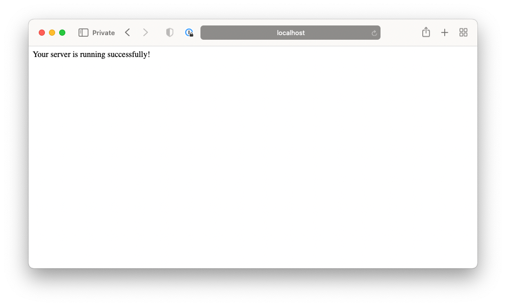

# Setting up a Flask project

[A video demonstration is here.](https://www.youtube.com/watch?v=1j0PS6e0CZk). <!-- OMITTED -->

Learn to set up a Flask project.

## Initial setup

[First, setup a new Python + Pytest project.](https://github.com/makersacademy/golden-square-in-python/blob/main/pills/setting_up_a_pytest_project.md)

Then, follow the additional steps below.

```shell
# Add the flask library
; pipenv install flask

# Create the main application file
; touch app.py

# Create the test_app.py tests file
; touch tests/test_app.py
```

## The `app.py` file

When building Flask web applications, this file will contain the application class. We have added a test route for you to check it working. Later on you will define your own _routes_ (and learn what a _route_ is).

```python
from flask import Flask

app = Flask(__name__)

@app.route("/test-route")
def test_route():
    return "Your server is running successfully!"
```

```shell
; pipenv shell # To open the virtual environment
; flask --debug run

 * Debug mode: on
WARNING: This is a development server. Do not use it in a production deployment. Use a production WSGI server instead.
 * Running on http://127.0.0.1:5000
Press CTRL+C to quit
 * Restarting with stat
 * Debugger is active!
 * Debugger PIN: 510-031-730

# This process will wait around for requests.
# This is good, keep going onto the next instruction.
# When you do want to stop it, hit ctrl+c
```

Now use your browser to visit `http://localhost:5000/test-route`. You should see the following page.




<!-- BEGIN GENERATED SECTION DO NOT EDIT -->

---

**How was this resource?**  
[😫](https://airtable.com/shrUJ3t7KLMqVRFKR?prefill_Repository=makersacademy%2Fweb-applications-in-python&prefill_File=pills%2Fsetting_up_flask_project.md&prefill_Sentiment=😫) [😕](https://airtable.com/shrUJ3t7KLMqVRFKR?prefill_Repository=makersacademy%2Fweb-applications-in-python&prefill_File=pills%2Fsetting_up_flask_project.md&prefill_Sentiment=😕) [😐](https://airtable.com/shrUJ3t7KLMqVRFKR?prefill_Repository=makersacademy%2Fweb-applications-in-python&prefill_File=pills%2Fsetting_up_flask_project.md&prefill_Sentiment=😐) [🙂](https://airtable.com/shrUJ3t7KLMqVRFKR?prefill_Repository=makersacademy%2Fweb-applications-in-python&prefill_File=pills%2Fsetting_up_flask_project.md&prefill_Sentiment=🙂) [😀](https://airtable.com/shrUJ3t7KLMqVRFKR?prefill_Repository=makersacademy%2Fweb-applications-in-python&prefill_File=pills%2Fsetting_up_flask_project.md&prefill_Sentiment=😀)  
Click an emoji to tell us.

<!-- END GENERATED SECTION DO NOT EDIT -->
